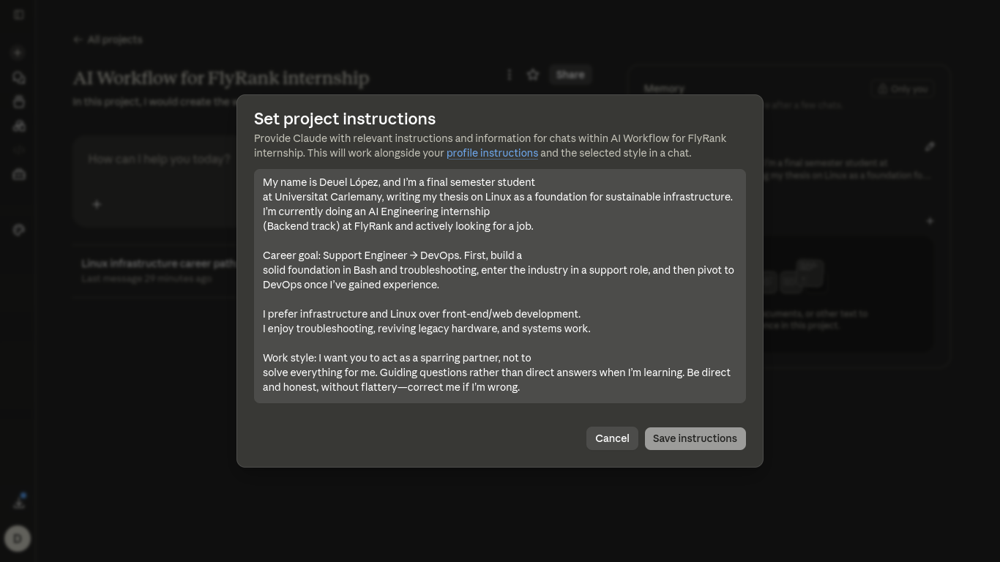

# AI Workflow Audit and Tool Setup

**FlyRank Internship — AI Fluency Track — FL-01 (Week 1)**
**Author:** Deuel López

## 1. Task Audit

| # | Task | Classification | Rationale |
|---|---|---|---|
| 1 | Studying Python (exercises, writing code) | Just me | If AI solves the exercises, I don't actually learn |
| 2 | Reading technical books (TLCL, How Linux Works, etc.) | Just me | Understanding has to be built by me, not delegated |
| 3 | Reading articles for my thesis | Just me | I need my own judgment to decide what's relevant |
| 4 | Anthropic Academy certifications | Just me | It's an evaluation of my own knowledge |
| 5 | Brainstorming portfolio project ideas | Collaborate with AI | Joint brainstorming, but the final decision is mine |
| 6 | Solving FlyRank internship assignments | Collaborate with AI | I use AI as a sparring partner; the code/understanding must be mine |
| 7 | Reading Linux documentation / man pages | Collaborate with AI | AI helps summarize, I verify in the terminal |
| 8 | Terminal troubleshooting | Collaborate with AI | AI suggests, I execute and validate results |
| 9 | Drafting examples/solutions for my thesis | Collaborate with AI | AI helps structure ideas, the final argument is mine |
| 10 | Searching for jobs (YC-backed startups) | Delegate to AI with review | AI filters by criteria, I review relevance |
| 11 | Researching a company before applying | Delegate to AI with review | AI summarizes public info, I decide what to use |
| 12 | Writing cold emails to founders | Delegate to AI with review | AI drafts structure, I adjust tone and personalize it |
| 13 | Documenting projects on GitHub (README, commits) | Delegate to AI with review | AI generates boilerplate, I confirm it reflects the real work |

## 2. Toolkit Setup

- ✅ Claude account
- ✅ ChatGPT account
- ✅ Anthropic Academy — *AI Fluency: Framework & Foundations* (certification completed)

## 3. Claude Project

A dedicated Claude Project ("AI Workflow for FlyRank internship") was created with custom instructions covering identity, career goal, work preferences, and current context.

## 4. Target Tasks (reused in FL-02 through FL-04)

**1. Solving FlyRank internship assignments — Collaborate with AI**
*Done well:* I understand and can explain every line of code I submit, without copy-pasting without comprehension; AI helped me get unstuck, not think for me.

**2. Documenting projects on GitHub — Delegate to AI with review**
*Done well:* AI-generated READMEs/commit messages accurately reflect what I actually did (no invented details), and I review every line before publishing.

**3. Job search / cold email outreach — Delegate to AI with review**
*Done well:* Emails genuinely sound like me (not generic or "AI-voiced"), and filtered job listings genuinely match my profile (Support → DevOps, YC-backed startups).
